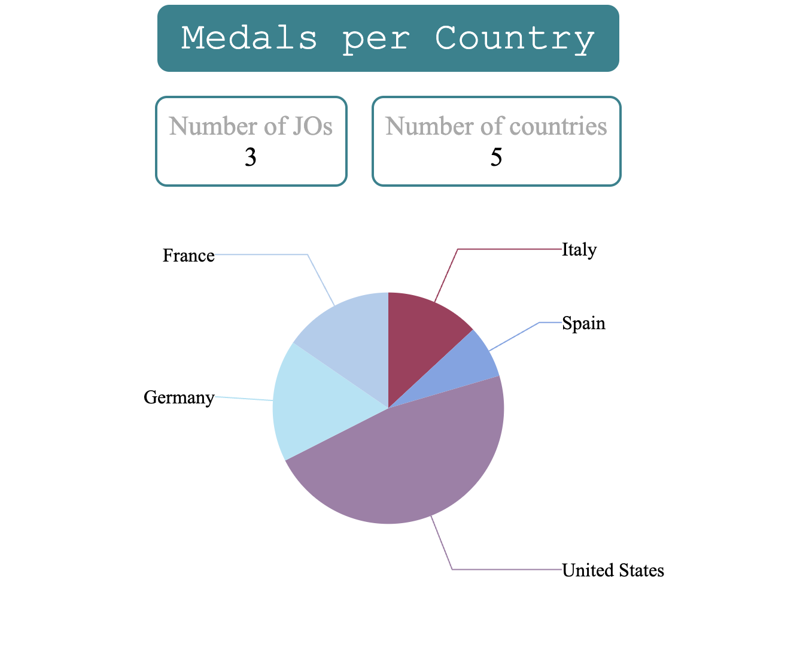
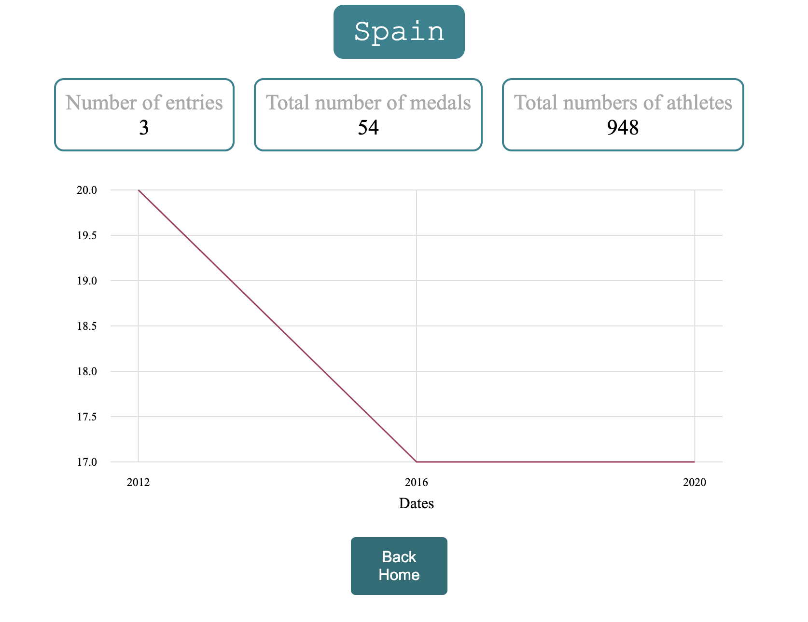

## Telesport Olympics
Description
This project is a SPA (Single Page Application) that presents useful information about recent Olympic Games participations by various countries.

# Features
The project offers two main features:

Homepage Pie Chart: A graphical representation showing participating countries (from a static dataset) and their total medal counts.
Details Page Line Chart: A detailed view displaying the total number of medals per Olympic participation and the count of participations.

# Navigation between pages
Homepage: The pie chart shows a segment for each participating country, colored differently. Hovering reveals their total medal count. Clicking on a segment navigates to that country's detailed page.
Details Page: Includes a button to return to the home page.
Not-Found Page: Contains a link that redirects back to the home page.
This project was bootstrapped with Angular CLI version 14.1.3.

# Remember to install your node_modules before starting the project by running npm install.

# Development Server
Execute ng serve to launch the development server. Navigate to http://localhost:4200/. The application will automatically reload upon any source file changes.

# Build
To build the project, run ng build. The build artifacts will be stored in the dist/ directory.

# The architecture of the project is predefined and includes, beyond the default Angular structure, the following:

core Folder: Contains business logic, with services and models.  
components Folder: Includes every reusable component, like a loader.  
pages Folder: Comprises components used for routing, such as the homepage, detailsPage, and not-foundPage.  
assets Folder: Contains subfolders for images (img) and mock data (mock) used in the exercise.  
environments Folder: Houses configuration settings for different environments.  
Good luck with your project!